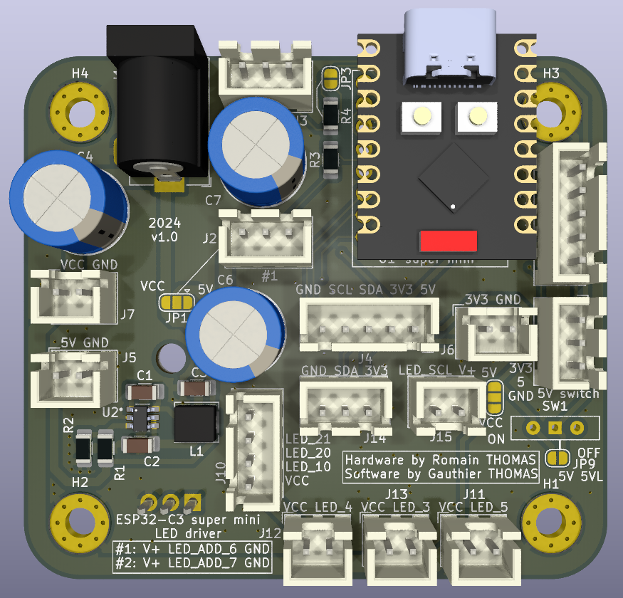
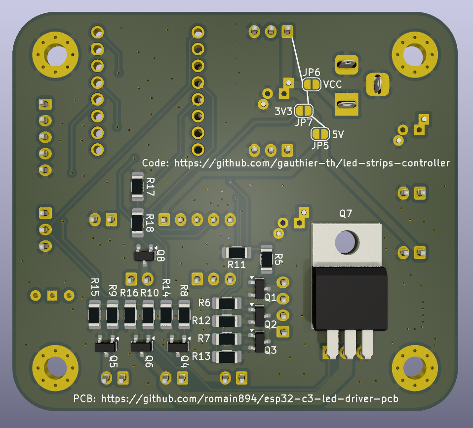

# ESP32-C3 Wi-Fi LED driver

PCB based on an ESP32-C3 super mini to control LED:

  - Wi-Fi
  - Up to 6 PWM channels with MOSFET
  - 3 analog inputs
  - 24-12V to 5V step down chip
  - Extension to add an IR remote
  - Possibility to add I2C peripherals
  - An extra MOSFET on a non-PWM channel (e.g. to control an ATX power supply)

v1.0: tests in progress

Romain THOMAS 2024

## PCB views

